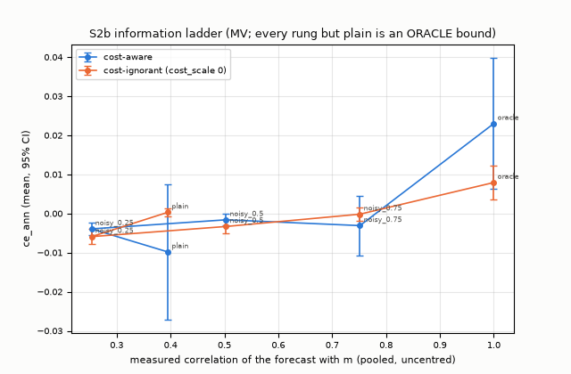
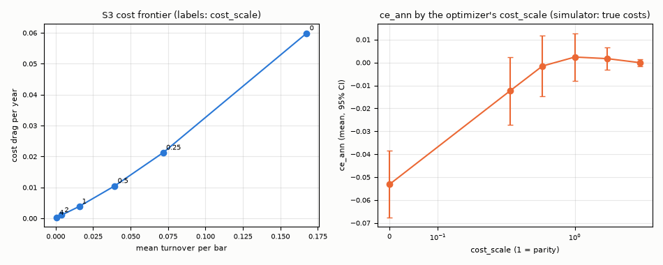
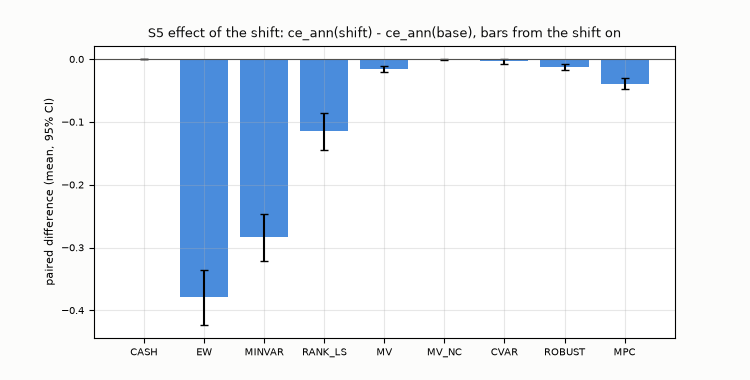
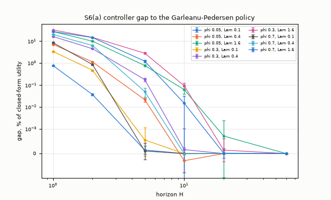
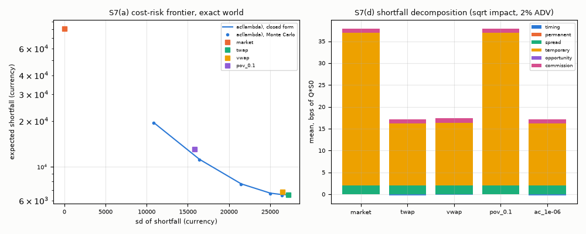

# Dynamic Portfolio & Execution Engine

**Research and simulation software. Not investment advice. No live trading, no broker connectivity.**

**Synthetic data only:** every market in this repository is generated by its own simulator with a planted, known signal (`docs/data.md`). Every number below is a simulation result, labelled "simulated", and holds only in this simulation, under these assumptions.

A simulation-only decision layer: a rolling predict-then-optimize loop with exact accounting, a family of convex portfolio optimizers checked against exact references, multi-period control checked against closed forms and dynamic programs, an execution simulator checked against the Almgren-Chriss solution, an information audit with canaries, and an evaluation protocol with one declared criterion, equal tuning effort, frozen configurations, and disjoint seeds.

**Status:** Benchmarked (simulated): every Tier-1 component built and tested; one protocol tuning run and one full evaluation on a synthetic market, and the eight Tier-2 items (Wasserstein ball, multi-asset Garleanu-Pedersen rule, adaptive execution, solver comparison, fat tails, cost misspecification, capacity, export consumer); the Tier-2 strategies were tuned once and every Tier-2 configuration was frozen before its evaluation (results below).


## What it is and what it is not

- It is a research-grade simulator of portfolio decisions and order execution on a synthetic market whose truth is known, so that each formulation can be checked against an exact answer and each comparison can be run on common random numbers.
- It is not a trading system: no broker, no exchange connection, no live or vendor data, no credentials, no paper trading. It makes no claim about profitability, alpha, or real-market performance; a planted signal that a strategy exploits shows that the machinery works, nothing more.

## The market

`market.generate(config, seed)` draws a factor market (one market and three sector factors, a calm/stress volatility regime, Gaussian tails) with a latent signal `s` of persistence 0.9 and per-bar information coefficient 0.02, publishes a noisy proxy `signal_x` (correlation 0.71 with `s`), splits each bar's return into an overnight and an intraday part, and adds delistings, splits, dividends, and late listings. The truth (`s`, the conditional mean `m`, the regime, the covariance) is a separate object that only the labelled oracle forecasts, the evaluators, the audit, and the tests receive. Every parameter is an assumption, documented in `docs/data.md`; the main market (`base`) has 30 instruments and 1260 daily bars. All files follow a shared language-neutral contract (`docs/contracts.md`).

## Components

- **Forecast providers:** `none`; `plain` (a pooled regression of the standardized next-bar return on `signal_x`, the predictor a real user could build); `noisy_oracle(rho)` and `oracle` (labelled bounds, never competitors).
- **Risk models:** sample, exponentially weighted, Ledoit-Wolf, principal-component factor; eigenvalue floor.
- **Optimizers (CVXPY, open-source solvers):** equal weight, rank-weighted long/short (naive baseline), minimum variance, mean-variance with the contract's convex transaction-cost model, CVaR (Rockafellar-Uryasev), robust mean-variance with box and ellipsoidal uncertainty sets, and a model-predictive controller on a horizon. Books: `LO` (long only, fully invested) and `LS` (dollar neutral, gross 2, positions 10 percent); optional turnover, sector, beta, and liquidity constraints. Every problem is built once with parameters (DPP), solved without warm starts, and its constraints are measured on the returned weights; a failed solve is a hold. `docs/optimization.md`.
- **Exact references:** closed forms for mean-variance, minimum variance, and quadratic-cost trading (R1-R3), CVaR and robust optimality (R4, R5), the Garleanu-Pedersen solution and a grid dynamic program (R6), a no-trade-band dynamic program for proportional costs (R7), and the Almgren-Chriss schedule (R8).
- **Rolling loop:** decisions every 5 bars after a 260-bar warmup, market orders filled at the next open with the contract's costs (spread, square-root impact from decision-time liquidity, commission), a participation cap, lots, splits, dividends, delistings, borrow and financing accruals, a leverage rule; the accounting identity is asserted on every bar, and an independent validator re-derives it from the logs. `docs/architecture.md`.
- **Execution simulator:** one parent order over intraday intervals with temporary and permanent impact, spread, commission, volume noise, a participation cap, partial fills, latency; policies market, TWAP, VWAP, POV, Almgren-Chriss; an exact implementation-shortfall decomposition. `docs/execution.md`.

## Information guards

The decision pipeline sees the market only through a knowledge-bounded, read-only `DecisionState`; a static test keeps the truth module out of its import graph. The replay audit re-runs every strategy in the real world and in a poisoned copy of the market in which everything after the decision instant is changed (prices, volumes, signal revisions, corporate actions, delistings, listings, the manifest), each world in its own directory with the registry pointing at it and every non-library module purged in between; orders must be bit-identical. Four canaries leak on purpose (a forecast that peeks through a memoized market handle, one that reads the files by path, a covariance estimated on the whole sample in a constructor, and an unlabelled oracle); each is caught by its guard, and no Tier-1 strategy, forecast provider, risk model, or optimizer raises an alarm (the Tier-2 strategies were added after the audit table and are not in it; see TODO). `docs/information.md`.

## Results (simulated)

All numbers below are **simulated**: the synthetic `base` market (30 instruments, 1260 daily bars; `docs/data.md`), the contract's cost model with its defaults (2 bp half spread, 1 bp commission, square-root impact), decisions every 5 bars after a 260-bar warmup, next-open fills, 10 million initial capital. Every strategy with parameters was tuned once with 16 random-search trials on tuning seeds 100-103 and frozen (`experiments/tuned/`); the evaluation ran once on seeds 1000 and up at commit `d85f01c` (clean tree; 2750 loop runs plus the non-loop experiments in 36 minutes with 2 workers on a shared Intel Core i9-14900KF, Windows 11, Python 3.12, CVXPY 1.9.3 with Clarabel 0.11.1; CPU load about 25 percent when it started, with another project's run active). Intervals are 95 percent Student-t intervals across seeds; paired differences are on the same seeds (wins/ties/losses). The declared criterion is `ce_ann` (`docs/protocol.md`). Every table: `docs/results.md`, generated by `scripts/make_tables.py` from `experiments/results/`.

In this simulation, under these assumptions:

**S2: main comparison** (30 seeds; `CASH` holds nothing and is a reference, not a registered strategy):

| strategy | ce_ann (95% CI) | vs EW (W/T/L) | vs RANK_LS (W/T/L) | Sharpe | gross exp. | flat bars |
|---|---|---|---|---|---|---|
| CASH | 0.0000 ± 0.0000 | +0.0789 ± 0.0490 (24/0/6) | +0.1277 ± 0.0278 (28/0/2) | 0.00 | 0.00 | 1.00 |
| EW | -0.0789 ± 0.0490 | - | +0.0488 ± 0.0578 (21/0/9) | 0.33 | 1.00 | 0.00 |
| MINVAR | -0.0486 ± 0.0460 | +0.0303 ± 0.0139 (26/0/4) | +0.0791 ± 0.0550 (22/0/8) | 0.36 | 1.00 | 0.00 |
| RANK_LS | -0.1277 ± 0.0278 | -0.0488 ± 0.0578 (9/0/21) | - | -0.67 | 1.46 | 0.00 |
| MV | 0.0011 ± 0.0110 | +0.0800 ± 0.0526 (23/0/7) | +0.1288 ± 0.0228 (29/0/1) | 0.07 | 0.48 | 0.00 |
| MV_NC | 0.0003 ± 0.0005 | +0.0792 ± 0.0491 (24/0/6) | +0.1280 ± 0.0274 (28/0/2) | 0.06 | 0.02 | 0.01 |
| CVAR | -0.0001 ± 0.0036 | +0.0788 ± 0.0484 (25/0/5) | +0.1276 ± 0.0271 (28/0/2) | -0.00 | 0.23 | 0.11 |
| ROBUST | 0.0045 ± 0.0101 | +0.0834 ± 0.0521 (23/0/7) | +0.1321 ± 0.0237 (29/0/1) | 0.10 | 0.35 | 0.17 |
| MPC | -0.0136 ± 0.0202 | +0.0653 ± 0.0554 (23/0/7) | +0.1141 ± 0.0207 (30/0/0) | 0.08 | 1.10 | 0.00 |

- By the rule fixed before the evaluation, the strategy named is `ROBUST` (highest mean `ce_ann`, 0.0045 ± 0.0101). It separated from `EW` (+0.0834 ± 0.0521) and from `RANK_LS` (+0.1321 ± 0.0237), **but not from `CASH`: at the default costs no strategy lies above holding cash.** The `ce_ann` intervals of the tuned long/short optimizers (`MV`, `MV_NC`, `CVAR`, `ROBUST`, `MPC`) contain zero, and `EW`, `MINVAR`, and `RANK_LS` lie below cash (`experiments/results/s2_paired.csv`). The tuned long/short optimizers hold small books (mean gross exposure 0.02 to 1.10; `MV_NC` was tuned to a nearly flat book; `ROBUST` and `CVAR` hold nothing on 17 and 11 percent of the bars). Presumably the planted signal (per-bar information coefficient 0.02, observed through a noisy proxy) is too weak against the costs; no run isolates that (the exact oracle of S2b does lie above zero, and so does `MV_NC` at half the simulator's costs, below).
- The deflated Sharpe ratio (the eight registered strategies as the trials of each seed) exceeds 0.95 on 1 of 30 seeds; it assumes selection by the Sharpe ratio while the criterion is `ce_ann`.
- `EW` and `MINVAR` (long only, fully invested) carry the market risk (annualized volatility 0.22 and 0.20) and lose on the variance penalty of `ce_ann` with `gamma_ce = 6`; with `gamma_ce = 3` their mean `ce_ann` is -0.0033 and +0.0113 (SENS, `docs/results.md`).
- SENS against cash (the frozen configurations; the cost settings change the simulator's costs while the optimizer's cost model stays, so they are a misspecification): at half the costs `MV_NC` lies above cash (0.0006 ± 0.0006) and the other long/short optimizers' intervals contain zero; at double the costs `MV` (-0.0131 ± 0.0100) and `MPC` (-0.0483 ± 0.0192) lie below it; on the `stress` market `CVAR` lies below it (-0.0069 ± 0.0066); with `gamma_ce` 12 `MPC` lies below it and with `gamma_ce` 3 none lies above it. `EW`, `MINVAR`, and `RANK_LS` lie below cash in every SENS setting except `gamma_ce = 3`, where the intervals of `EW` and `MINVAR` contain zero (`experiments/results/sens.csv`).

**S2b: information ladder** (MV with forecasts of known quality; every rung but `plain` is an `ORACLE` bound with its own budget of 8 `gamma` values): only the exact oracle has a `ce_ann` interval above zero (0.0230 ± 0.0168 cost-aware, 0.0079 ± 0.0043 cost-ignorant). The plain predictor's measured correlation with the true conditional mean is 0.395, between the noisy oracles with 0.25 and 0.5; neither it nor any noisy oracle has an interval above zero, and the noisy oracles with 0.25 and 0.5 are below zero (cost-aware -0.0039 ± 0.0015 and -0.0016 ± 0.0015). The noisy oracles draw new noise every bar, so their forecasts turn over every bar; their tuned `gamma` sits at the conservative end of the grid except at 0.75 (cost-aware).



**S3: costs, constraints, schedule** (tuned MV at the parity setting `cost_scale` 1, 20 seeds, paired against parity): ignoring costs (`cost_scale` 0) loses 0.0554 ± 0.0131 of `ce_ann` (0/0/20) with 0.17 turnover per bar and a cost drag of 6 percent a year; `cost_scale` 0.25 loses 0.0148 ± 0.0096; from 0.5 to 4 the differences include zero. The long-only book loses 0.0632 ± 0.0526. Turnover bounds, rebalancing every bar or every 21 bars, sector neutrality, and a beta band did not separate from the parity setting (every interval contains zero). The tuned MV itself (tuned `cost_scale` 0.36) is 0.0085 ± 0.0081 below the parity setting on the evaluation seeds.



**S4: risk models** (minimum-variance portfolio, 20 seeds): the realized out-of-sample volatility (the declared quantity) differs by at most 0.002 between the models at the default window (0.200 to 0.202 on `base`); it rises as the window shrinks toward the number of instruments (0.214 to 0.218 at `n/W = 1`). Ledoit-Wolf has the lowest relative Frobenius error at every window and market (0.59 to 0.64) and is below the sample covariance's error at 66 to 74 percent of the decisions; on `wide` (100 instruments) the 3-factor PCA model has the lowest mean realized volatility at every window (0.181 to 0.186), ahead of Ledoit-Wolf by at most 0.0011, far inside the intervals of about ±0.009 (S4 declares no paired test, so this is not a separation).

**S5: distribution shift** (volatility x1.5, correlation x1.5, information coefficient x0.5, premium -5 percent a year from bar 630; 30 seeds; effect = paired `ce_ann` of the bars after the shift, shift run minus base run): the mean effect is negative for every invested strategy: -0.379 ± 0.044 for `EW`, -0.0153 ± 0.0045 for `MV`, -0.0122 ± 0.0048 for `ROBUST`, -0.0034 ± 0.0038 for `CVAR` (interval contains zero), and -0.0389 ± 0.0093 for `MPC`. After the shift, `CVAR` (+0.0102 ± 0.0108) and `ROBUST` (+0.0055 ± 0.0061) are not separated from `MV`; both hold smaller books than `MV`. The `RETUNED` bound (strategies re-tuned on shifted tuning markets) re-selected the same configuration for MV, MV_NC, CVAR, and RANK_LS (exact ties) and configurations with `ce_ann` near zero for ROBUST and MPC.



**S6: multi-period control against the exact references.** (a) Against the Garleanu-Pedersen closed form (one asset, quadratic costs, 20 seeds x 200 paths x 500 steps): the controller's gap in discounted utility falls with the horizon, from 0.8 to 32 percent at `H = 1` to at most 0.094 percent at `H = 10` and at most 0.001 percent at `H = 20`, across `phi_gp` 0.05/0.3/0.7 and `Lam` 0.1/0.4/1.6. (b) Against the proportional-cost dynamic program (one seed, 50 paths, 250 steps): the gaps are within 0.035 percent at `c_prop` 1e-4 and 4e-4 for `H` 1, 5, 20; four of the six are slightly negative (-0.0075 to -0.0049 percent: the controller scored above the program's band policy on these paths, presumably because that band is computed on a grid; not tested). (c) In the market, the controller with the tuned MV configuration gains over `H = 1` (which is MV, bit for bit): +0.0047 ± 0.0040 at `H = 2`, +0.0064 ± 0.0060 at `H = 5`, +0.0067 ± 0.0064 at `H = 10` (15/0/5 each).



**S7: execution** (13 intraday intervals over one bar, 20 seeds x 2000 paths): (a) in the exact Almgren-Chriss world the Monte Carlo means of every schedule are within one standard error of the closed form, and no baseline (market, TWAP, VWAP, POV 10 percent) has a lower `E + lambda V` than `ac(lambda)` at any of the 7 values of `lambda`, in closed form or within the Monte Carlo error; (b) under square-root impact with a U-shaped volume profile, volume noise, and a 10 percent participation cap, TWAP, VWAP, and `ac(1e-6)` cost 9.8 to 10.0 bps of the notional at 0.5 percent of ADV and 16.9 to 17.2 bps at 2 percent, against 28.5 and 37.9 bps for sending everything at once (POV 10 percent executes the same here); at 10 percent of ADV the cap binds and completion falls to 0.93 to 0.97; (c) a latency of 1 or 2 intervals lowers the completion of the slicing policies to 0.80 to 0.93 because they do not plan for it; (d) temporary impact is the largest component (14 to 35 bps of totals of 17 to 38 bps).



**S8: re-costing the loop's orders** (tuned MV at 1e6, 1e7, 1e8 of capital, 10 seeds): executing each parent order with TWAP over its fill bar reproduces the loop's single-print cost (4.6, 6.6, 9.0 bps): the square-root model depends only on the participation rate, which TWAP keeps; executing it all in the first interval costs 8.7 to 20.8 bps. The participation cap binds on 0.34 percent of the loop's orders at 1e8.

**S1: exact references:** the closed forms R1-R3 to 1e-11 or better, R4 below 1e-15 (no solve), R5 9e-7 in the weights, the R6 known answer to 2e-16 and the `H = 60` controller to 4e-15, the grid programs within 0.56 (R6) and 0.26 (R7) grid steps, the R8 known answers to 6e-15 (`docs/figures/exact_references.png`). Over the whole evaluation: 454,064 `optimal` solves, 396 `optimal_inaccurate` (every constraint within 1.2e-7), 0 failures; the accounting identity held to 8.7e-16 relative.

### Tier-2 results (simulated)

Each Tier-2 strategy was tuned once with the protocol of S2 (16 trials, tuning seeds 100-103) and frozen in `experiments/tuned/frozen_tier2.json` together with every loop configuration of the Tier-2 studies, before they ran (Tier-2 code `91b2060` to `cc4e22a`). After every Tier-2 change the quick results of S1-S8 and SENS reproduced, outside the `wall_` columns, the SHA-256 recorded at the evaluation commit (`experiments/results/quick_sha256.txt`). This bit-for-bit reproduction was checked on the build machine only (Windows 11, Python 3.12.3, NumPy 2.5.3, SciPy 1.18.1, CVXPY 1.9.3 with Clarabel 0.11.1, OSQP 1.1.3, and SCS 3.3.1). An independent check on Linux (x86-64, the same Python and package versions) got quick results that agree with these to about 1e-3 relative per run but not byte for byte: all 20 hashes differed, 172 of the 276 quick runs differ by more than 1e-6 relative in at least one column (at most 1.2e-3 in `ce_ann` and 3.4e-3 in the gross Sharpe ratio, each in a single run), and the S2 quick seed means agree to four digits with the same order of the strategies and the same win/tie/loss counts. That is the usual difference in an interior-point solver's path between math libraries, so on another platform compare the quick results numerically, not by hash. The committed full results were produced on Windows only and were not regenerated on Linux. The committed Tier-2 results come from one run on the clean commit `cc4e22a` (2 workers; 1 for the adaptive-execution and solver studies). Tables: `docs/results_tier2.md`.

- **Wasserstein-robust mean-CVaR** (`WDRO`, 30 seeds; `docs/optimization.md`): on `base` its `ce_ann` is -0.0229 ± 0.0199, below `CASH` and below `MV` by 0.0241 ± 0.0126 (7/0/23). On `shift`, the effect of the shift on it is -0.0516 ± 0.0142 (against -0.0153 ± 0.0045 for `MV` in S5; the two effects are not paired with each other), and after the shift it lies below `MV` by 0.0612 ± 0.0221 (5/0/25). Its tuned configuration (radius `eps_w` 2.9e-4, `eta_cvar` 0.0090, `alpha` 0.975, `cost_scale` 0.35) scored best on the tuning seeds (mean `ce_ann` +0.0082) and did not carry over to the evaluation seeds; which parameter is responsible is not isolated.
- **Multi-asset Garleanu-Pedersen rule** (`GP_AIM`, 30 seeds): `ce_ann` 0.0015 ± 0.0089; not separated from `MV` (+0.0004 ± 0.0039, 14/0/16) or from `CASH`, and above `MPC` (+0.0151 ± 0.0127, 17/0/13).
- **Adaptive execution** (5 percent of ADV, square-root impact, cap 0.1; 20 seeds x 2000 paths, common random numbers): with a persistent per-path volume level that the expected profile does not know (log-sd 0.5), re-planning the Almgren-Chriss schedule with the realized volumes lowers the shortfall by 0.238 ± 0.038 bps against the static schedule (by 0.046 ± 0.012 bps when the expected profile is also flat while the true one is U-shaped); with a correct profile it is not separated from the static schedule (-0.0002 ± 0.0037 bps), and with a flat expected and a U-shaped true profile and no level it costs 0.006 ± 0.005 bps more. In this model the temporary impact is computed from the decision-time ADV, not from the interval's realized volume (`docs/execution.md`), so following the volume profile does not lower impact: TWAP costs 0.47 ± 0.06 bps less than VWAP when the profile is right (`docs/results_tier2.md`).
- **Solver comparison** (`docs/figures/tier2_solvers.png`): against the closed forms R1-R3, Clarabel, OSQP, SCS, and HiGHS agree to 6e-7 or better; by the optimizers' failure rule (a status other than optimal or optimal_inaccurate, or a constraint violated by more than 1e-6; the table does not record which), HiGHS failed 1 of 10 quadratic long/short problems at `n` = 30 and OSQP (tolerance 1e-9) failed 17 of the 20 CVaR linear programs; only Clarabel and SCS take the 1.5-power cost (SCS about 10 times slower). Gurobi was not importable in the project environment and was skipped.
- **Fat tails and jumps** (assumed tail models, frozen S2 configurations, 30 seeds): with Student-t (5 degrees of freedom) or jump returns the picture of S5 is unchanged: `CVAR` and `ROBUST` are not separated from `MV` before or after the shift.
- **Cost misspecification** (tuned MV, impact `y` 0.25/0.5/1, capital 1e7/1e8, the optimizer believing half or twice the true costs; 20 seeds): every loss against the parity setting is within 0.006 of `ce_ann`; the only one whose interval excludes zero is believing half the costs at `y` 0.25 and 1e7 (-0.0058 ± 0.0053).
- **Capacity** (tuned MV and the naive RANK_LS from 1e6 to 1e9; `docs/figures/tier2_capacity.png`): MV's mean `ce_ann` stays between -0.006 and -0.001 at every capital with the cap binding on at most 1 percent of its fills; RANK_LS stays far below it (the cap binds on 80 percent of its fills at 1e9, which also limits its trading), so the capacity at which MV falls to the naive baseline is not reached within this grid.
- **Export consumer**: an export written by this repository, read back through the consumer (hashes, schemas, knowledge rule), reproduces the in-memory run's logs exactly; no export of the research engine was available, so that part was skipped.

What the results do not show: anything about real markets or profitability; the ranking on another synthetic market family; a strategy that lies above holding cash at the default costs in this market (only `MV_NC` does, under the half-cost sensitivity setting).

## How to run

Python 3.12. Windows PowerShell (each command below was run as written on Windows 11):

```powershell
powershell -ExecutionPolicy Bypass -File scripts\setup_env.ps1
.\.venv\Scripts\Activate.ps1
python -m pytest -q
python -m dynamic_trading_engine experiment --quick --workers 2
python -m dynamic_trading_engine validate --root experiments/outputs/quick/logs
python -m dynamic_trading_engine audit --out experiments/outputs/audit_table.csv
python -m dynamic_trading_engine run --strategy MV --market tiny --seed 1 --out experiments/outputs/demo
python -m dynamic_trading_engine report --run experiments/outputs/demo/run --out experiments/outputs/demo/report
python -m dynamic_trading_engine bench --quick
```

Linux or macOS (the same commands for that shell). They were not run on the build machine; an independent check ran them once on Linux (x86-64, Python 3.12.3, the same package versions, `LANG` unset, with `PYTHON=/usr/bin/python3.12` for `setup_env.sh`, which takes the interpreter from `PYTHON`, else `python3`, else `python`). Setup, `ruff`, the quick experiments, `validate`, `audit` (its table byte-identical to the committed one), `run`, `report`, and `bench --quick` passed there; two tests failed on platform-dependent last digits (the solver-agreement test trusted a SciPy reference that stalled, and the tuning-log test compared a float by its exact text) and were fixed afterwards, without a second Linux run; and the quick-result hashes differed (Tier-2 results above). The upload strips the executable bit, so run scripts through `bash` (or run `chmod +x scripts/*.sh` once):

```bash
bash scripts/setup_env.sh
source .venv/bin/activate
python -m pytest -q
python -m dynamic_trading_engine experiment --quick --workers 2
python -m dynamic_trading_engine validate --root experiments/outputs/quick/logs
python -m dynamic_trading_engine audit --out experiments/outputs/audit_table.csv
python -m dynamic_trading_engine run --strategy MV --market tiny --seed 1 --out experiments/outputs/demo
python -m dynamic_trading_engine report --run experiments/outputs/demo/run --out experiments/outputs/demo/report
python -m dynamic_trading_engine bench --quick
```

The full protocol (tuning, freeze, evaluation, figures, tables) is in `simulations/README.md`. Set `PYTHONUTF8=1` on Windows if your shell does not. The commands use 2 worker processes and one BLAS thread per process.

## Repository layout

```text
src/dynamic_trading_engine/
  contracts/     formats of the shared contract, cost model, canonical hashes
  market/        generator, truth (separate), liquidity, contract-file store, export consumer
  state/         knowledge-bounded view and DecisionState
  forecasts/     none, plain; oracle.py (labelled bounds)
  risk/          sample, EWMA, Ledoit-Wolf, PCA
  optimization/  cached DPP problems, the optimizer family, failure rule, Wasserstein problem
  policies/      multi-period references (Garleanu-Pedersen, grid DPs, controllers), GP rule
  execution/     execution simulator, policies, Almgren-Chriss reference, adaptive policy
  engine/        rolling loop, logs, independent validator
  strategies/    pipeline strategy, factory, scripted test strategies
  analytics/     metrics, statistics
  audit/         poisoned worlds, replay, canary loader, audit table
  experiments/   registry, tuner and guards, runner, S1-S8, SENS, Tier 2, tables, report
  cli/           command-line entry points
tests/           unit, property, reference, determinism, protocol tests; canaries/; golden fixtures
configs/market/  market configurations
experiments/     configs/registry.json, tuned/ (frozen configurations), results/ (committed)
docs/            architecture, contracts, data, optimization, execution, information, protocol, results
scripts/         setup, figures, tables
```

## Stack

Python 3.12, NumPy, SciPy (reference solver and statistics), CVXPY with Clarabel (default), OSQP and SCS (second solvers in tests), Matplotlib (figures); pytest, pytest-repeat, ruff for development.

## Goals and non-goals

Goals: a rolling predict-then-optimize loop with exact accounting; portfolio strategies compared on the same synthetic data with the same costs and schedule (equal weight, minimum variance, mean-variance with and without costs, CVaR, robust mean-variance with box and ellipsoidal uncertainty sets, a model-predictive controller), with a forecast whose quality is known; constraints that matter in practice (budget, position bounds, gross and net exposure, leverage, turnover, sector and beta exposure, liquidity, transaction costs); experiments under distribution shift; execution baselines (TWAP, VWAP, POV) and the Almgren-Chriss schedule. A distributionally robust mean-CVaR over a Wasserstein ball is built as a Tier-2 strategy (`WDRO`).

Non-goals: live trading, broker connectivity, paper trading, or investment advice; low-latency execution; any statement about returns or profitability in real markets.

## Reference projects

- [cvxgrp/cvxportfolio](https://github.com/cvxgrp/cvxportfolio) (GPL-3.0): multi-period convex portfolio optimization; not installed, nothing copied or adapted (the formulations here follow the papers listed below).
- [AI4Finance-Foundation/FinRL](https://github.com/AI4Finance-Foundation/FinRL) (MIT): reinforcement-learning trading environments (not used; reinforcement learning is out of scope).
- [nautechsystems/nautilus_trader](https://github.com/nautechsystems/nautilus_trader) (LGPL-3.0): event-driven trading architecture (not read in this build).

Papers whose formulations are implemented: Markowitz; Ledoit and Wolf (2004); Rockafellar and Uryasev (2000); Garleanu and Pedersen (2013); Almgren and Chriss (2000); Bailey and Lopez de Prado (the deflated Sharpe ratio); Boyd and co-authors (multi-period trading via convex optimization).

## Available now

- `python -m pytest -q`: the unit, property, reference, determinism, protocol, audit, and quick-experiment tests (the checks listed in `docs/optimization.md`, `docs/execution.md`, `docs/information.md`, and `docs/protocol.md`).
- `python -m dynamic_trading_engine experiment --quick`: every experiment at the quick scale (about a minute with 2 workers on the development machine), outputs labelled QUICK under `experiments/outputs/quick/`.
- `python -m dynamic_trading_engine tune | freeze | experiment`: the full protocol (`simulations/README.md`); the committed results are in `experiments/results/`, the tuned and frozen configurations in `experiments/tuned/`.
- `python -m dynamic_trading_engine tier2 tune | freeze | freeze-more | run | adaptive | solvers | tails | costmis | capacity | export`: the Tier-2 items (`simulations/README.md`); results in `experiments/results/tier2/`, figures and tables from `scripts/plot_tier2.py` and `scripts/make_tables_tier2.py`.
- `python -m dynamic_trading_engine quickhash`: the SHA-256 of the quick result files without their `wall_` columns; on the build machine's stack it equals `experiments/results/quick_sha256.txt` byte for byte, while on another platform the quick results differ in the last digits (about 1e-3 relative per run on Linux) and are compared numerically instead.
- `python -m dynamic_trading_engine audit`: the information audit and its table (`experiments/results/audit_table.csv`).
- `python -m dynamic_trading_engine run | validate | report`: one run with the contract's logs, the independent validator, and a Markdown/PNG report.
- `python -m dynamic_trading_engine generate`: a synthetic market as contract files; `sample`: the committed sample run in `docs/examples/sample_run/`.
- `python -m dynamic_trading_engine bench`: microbenchmarks (solves per second by problem type and size, loop bars per second, simulator paths per second; wall and CPU time, minimum of five repetitions).

## TODO

- Run the GitHub workflow (ubuntu-latest) and the fixed test suite on Linux again: today the test suite and the README commands ran on Windows on the build machine and once on Linux in an independent check, where two tests failed on platform-dependent last digits (fixed since, not re-run there); the workflow passes `actionlint` but has never run.
- A second synthetic market family (other factor structures, signal strengths, cost levels): today every result comes from one generator with one set of assumed parameters, and at the default costs no strategy lies above holding cash on it.
- A robust radius chosen out of sample: today `WDRO`'s tuned configuration (radius 2.9e-4) did not carry over from the tuning to the evaluation seeds; a nested or walk-forward choice of `eps_w` is not implemented.
- Audit the Tier-2 strategies: today the audit table covers every Tier-1 strategy, forecast provider, risk model, and optimizer; `WDRO`, `GP_AIM`, and the export forecast provider were added later and are not in it.
- Consume an export of the research engine: today the consumer is tested on exports written by this repository only (none from the research engine was available).
- Gurobi in the solver comparison: today it was skipped (not importable in the project environment); it is optional and never required.
- Limit orders and a queue model: today the loop and the simulator use market orders only.
- Intraday data in the loop: today the loop trades daily bars and the execution simulator is only tied to it by the cost parity and the post-hoc re-costing of S8.
- Wall-clock numbers on an idle machine, with the load in the manifests: today they come from a shared workstation with other jobs running; the manifests record the hardware, the worker count, and the thread settings but not the load (the load sampled when the evaluation started is stated above).

## License

MIT
