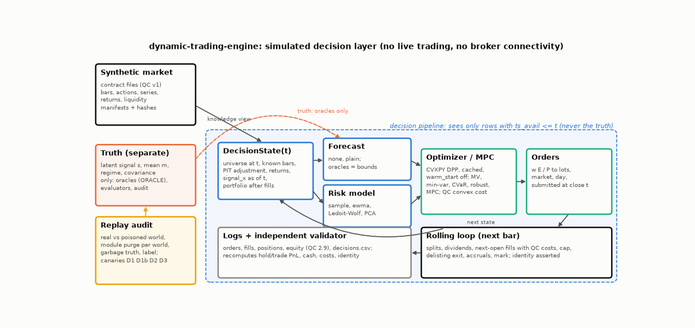

# Architecture

## Modules (`src/dynamic_trading_engine/`)

| Package | Role | Sees the truth? |
|---|---|---|
| `contracts/` | the contract's schemas (loaders, validators, writers), timestamps, canonical JSON and configuration hashes, manifests, the cost model | no |
| `market/` | configuration, calendar, generator (`generator.py`, returns the market and the `Truth`), `truth.py`, liquidity function, contract-file store, registry of the current market directory, the consumer of the contract's export format (`export.py`, Tier 2) | only `generator.py` and `truth.py` |
| `state/` | the knowledge-bounded view and the `DecisionState` | no |
| `forecasts/` | `none`, `plain` (`simple.py`); the oracle providers in `oracle.py` (labelled bounds) | only `oracle.py` |
| `risk/` | `sample`, `ewma`, `lw`, `pca`, eigenvalue floor | no |
| `optimization/` | cached DPP problems (`problems.py`), the optimizer family and the failure rule (`optimizers.py`), random test problems (`testing.py`), the Wasserstein-robust mean-CVaR problem and the Tier-2 solve paths (`wdro.py`, `tier2.py`) | no |
| `policies/` | multi-period references: Garleanu-Pedersen closed form, grid dynamic programs, single-asset controllers; the multi-asset Garleanu-Pedersen rule (`gp_aim.py`, Tier 2) | no |
| `execution/` | the execution simulator, its policies, the Almgren-Chriss reference, the adaptive Almgren-Chriss policy (`adaptive.py`, Tier 2) | no |
| `engine/` | the rolling loop, the logs, the independent validator, the strategy interface | no |
| `strategies/` | the built-in pipeline strategy (`pipeline.py`), scripted test strategies, the factory that builds a strategy from a spec and hands oracles the truth (`factory.py`) | only `factory.py` |
| `analytics/` | metrics of the contract, the criterion, summary statistics | no |
| `audit/` | poisoned worlds, replay with a module purge, garbage truth, label audit, the audit table | yes |
| `experiments/` | registry, tuner and guards, freeze, runner, experiments S1-S8 and SENS, the Tier-2 studies (`tier2.py`, `tier2_more.py`, `solvers.py`), tables, report, benchmarks | yes |
| `cli/` | command-line entry points | yes |

A static test reads the import graph and enforces the right-hand column.

## Knowledge time

Every row of the contract's datasets carries `ts_avail`; a row is known at `t` iff `ts_avail <= t`. Instruments are known from `ts_list`; their delisting fields from `ts_delist` on. Corporate actions are known from their announcement. The decision state is built at the close of a decision bar (`t` = its `ts_event`) and contains only rows known then, as read-only copies.

## The flow of one decision

1. The loop builds `DecisionState(t)`: the universe at `t`, the last 520 bars of known closes, returns, `signal_x` (as of `t`), liquidity rows, the point-in-time adjusted closes, and the portfolio after all fills up to `t` (cash, quantities, equity, weights at the closes, previous target).
2. The strategy selects the optimized instruments (at least 60 known bars, a known close and return at `t`), asks its forecast provider for `mu`, `se`, `decay`, and its risk model for `Sigma` over the common window.
3. The optimizer fills the parameters of the cached problem for (book, optimizer, ladder size) and solves with `warm_start=False`; a failed solve is a hold.
4. The loop turns target weights into orders: target quantity `w_i E / P_i` rounded toward zero to the lot, minus the current quantity; market orders, `day`, submitted at the close of `t`, with the liquidity inputs known at `t` attached for the cost model.

## The loop (per bar, in the contract's order)

1. Splits effective in the bar rescale the opening quantity, the previous close, and pending orders; 2. dividends on the opening quantity before the split, credited at the close; 3. fills of the orders submitted at the previous decision at the bar's open (participation cap from the bar's volume, the rest cancelled; nothing fills without a bar or in a zero-volume bar; orders that would take the gross exposure above `max_leverage` = 1.05 times the book's gross bound are scaled down and logged); 4. the forced exit of an instrument in its last bar at `close * (1 + delist_return)`; 5. accruals (borrow, financing, interest); 6. the mark to the close; then, on a decision bar, the decision. The accounting identity of the contract is asserted on every bar to `1e-9 * max(1, |E|)`; an independent validator re-derives positions, cash, every flow, and the identity from the CSV logs, the bars, and the corporate actions.

## Logs

`orders_v1.csv`, `fills_v1.csv`, `positions_v1.csv`, `equity_v1.csv` (the contract's formats) and `decisions.csv` (instant, strategy, forecast and its `oracle` flag, risk model, solver status, objective, number of trades, turnover, `wall_solve_ms`, hold), each with a manifest, plus `run.json`. A sample run (the first 150 bars of the `tiny` market) is committed in `docs/examples/sample_run/`.
